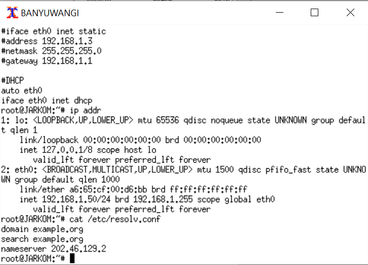

# Jarkom_Modul3_Lapres_E08

## 1. Membuat topologi jaringan
- Membuat file topologi.sh dengan isian
- 

## 2. SURABAYA ditunjuk sebagai perantara (DHCP Relay) antara DHCP Server dan client
- Pada UML Surabaya, membuka file dengan cara ``` nano /etc/sysctl.conf ```
- Uncomment dan mengubah menjadi ``` net.ipv4.conf.all.accept_source_route = 1 ```
- Simpan lalu jalankan ``` sysctl -p ```
- Install DHCP Relay dengan ``` apt-get install isc-dhcp-relay ```
- Buka file ``` nano /etc/default/isc-dhcp-relay ```
- Konfigurasi seperti gambar di bawah ini
- 
- Pada UML Tuban, buka file ``` nano /etc/dhcp/dhcpd.conf ```
- Konfigurasi seperti gambar di bawah ini
- 

## 3. Client pada subnet 1 mendapatkan range IP dari 192.168.0.10 sampai 192.168.0.100 dan 192.168.0.110 sampai 192.168.0.200
- Pada UML Tuban, buka file ``` nano /etc/dhcp/dhcpd.conf ```
- Konfigurasi seperti gambar di bawah ini
- 
- Jalankan ``` service isc-dhcp-server restart ```
- Pada UML Gresik dan Sidoarjo (Subnet 1), buka file ``` nano /etc/network/interfaces ```
- Konfigurasi seperti gambar di bawah ini
- 
- Cek keberhasilan di UML Sidoarjo dan/atau Gresik dengan ``` cat /etc/resolv.conf ```
- 

## 4. Client pada subnet 3 mendapatkan range IP dari 192.168.1.50 sampai 192.168.1.70
- Pada UML Tuban, buka file ``` nano /etc/dhcp/dhcpd.conf ```
- Konfigurasi seperti gambar di bawah ini
- 
- Jalankan ``` service isc-dhcp-server restart ```- Jalankan ``` service isc-dhcp-server restart ```
- Pada UML Banyuwangi dan Madiun (Subnet 1), buka file ``` nano /etc/network/interfaces ```
- Konfigurasi seperti gambar di bawah ini
- 
- Cek keberhasilan di UML Banyuwangi dan/atau Madiun dengan ``` cat /etc/resolv.conf ```
- 

## 5. Client mendapatkan DNS Malang dan DNS 202.46.129.2 dari DHCP
- Pada UML Tuban, buka file ``` nano /etc/dhcp/dhcpd.conf ```
- Konfigurasi seperti gambar di bawah ini
- 
- Jalankan ``` service isc-dhcp-server restart ```

## 6. Client di subnet 1 mendapatkan peminjaman alamat IP selama 5 menit, sedangkan client pada subnet 3 mendapatkan peminjaman IP selama 10 menit
- Pada UML Tuban, buka file ``` nano /etc/dhcp/dhcpd.conf ```
- Konfigurasi seperti gambar di bawah ini
- 
- Jalankan ``` service isc-dhcp-server restart ```

## 7. Akses ke proxy hanya bisa dilakukan oleh Anri sendiri sebagai user TA
- Pada UML Mojokerto, menjalankan ``` htpasswd -c /etc/squid/passwd userta_e08 ```
- Input password yaitu ``` inipassw0rdta_e08 ```
- 
- Membuka file ``` nano /etc/squid/squid.conf ```
- Konfigurasi seperti gambar di bawah ini
- 
- Jalankan ``` service squid restart ```
- Bukti keberhasilan
- 
- 

## 8. Anri sudah menjadwal pengerjaan TA-nya (8) setiap hari Selasa-Rabu pukul 13.00-18.00
- Pada UML Mojokerto, buka file ``` nano /etc/squid/acl.conf ```
- Konfigurasi seperti gambar di bawah ini
- 
- Membuka file ``` nano /etc/squid/squid.conf ```
- Konfigurasi seperti gambar di bawah ini
- 
- Jalankan ``` service squid restart ```
- Bukti keberhasilan
- 
- 

## 9. Jadwal bimbingan dengan Bu Meguri adalah (9) setiap hari Selasa-Kamis pukul 21.00 - 09.00 keesokan harinya (sampai Jumat jam 09.00)
- Pada UML Mojokerto, buka file ``` nano /etc/squid/acl.conf ```
- Konfigurasi seperti gambar di bawah ini
- 
- Membuka file ``` nano /etc/squid/squid.conf ```
- Konfigurasi seperti gambar di bawah ini
- 
- Jalankan ``` service squid restart ```
- Bukti keberhasilan
- 

## 10. Agar Anri bisa fokus mengerjakan TA, (10) setiap dia mengakses google.com, maka akan di redirect menuju monta.if.its.ac.id agar Anri selalu ingat untuk mengerjakan TA🙂
- Membuka file ``` nano /etc/squid/squid.conf ```
- Konfigurasi seperti gambar di bawah ini
- 
- Jalankan ``` service squid restart ```
- Bukti keberhasilan
- 

## 11. Bu Meguri meminta Anri untuk mengubah error page default squid
- Pada UML Mojokerto download dengan command ``` wget 10.151.36.202/ERR_ACCESS_DENIED ```
- Copy file yang baru di download dengan ``` /usr/share/squid/errors/en/ERR_ACCESS_DENIED ```
- Membuka file ``` nano /etc/squid/squid.conf ```
- Konfigurasi seperti gambar di bawah ini
- 
- Jalankan ``` service squid restart ```
- Bukti keberhasilan
- 

## 12. Karena Bu Meguri dan Anri adalah tipe orang pelupa, maka untuk memudahkan mereka, Anri memiliki ide ketika menggunakan proxy cukup dengan mengetikkan domain janganlupa-ta.yyy.pw dan memasukkan port 8080
- Pada UML Malang membuka file ``` /etc/bind/named.conf.local ```
- Konfigurasi seperti gambar di bawah ini
- 
- Membuka file ``` /etc/bind/jarkom/janganlupa-ta.e08.pw ```
- Konfigurasi seperti gambar di bawah ini
- 
- Ubah setting proxy
- 
- Bukti keberhasilan
- 
